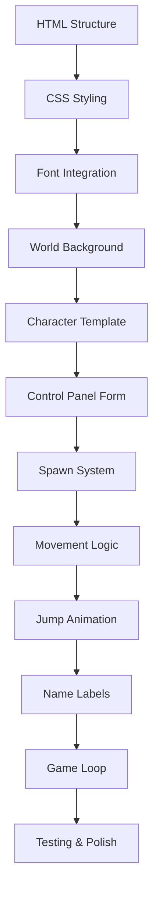

# Minecraft Character Simulator - Architecture Plan

## Overview

A fully functional Minecraft-style character simulator with autonomous behavior, built using only HTML5, CSS, and vanilla JavaScript in a single file.

## Technical Specifications

### 1. World Environment

- **Canvas**: Full viewport (100vw × 100vh)
- **Background**: Multi-layered Minecraft landscape
  - Sky gradient (light blue to darker blue)
  - Grass layer (bright green, ~30% of height)
  - Dirt layer (brown, ~20% of height)
  - CSS-based blocky texture patterns
- **Boundaries**: Characters constrained within viewport edges

### 2. Character Design

#### Proportions (Authentic Minecraft Style)

- **Total Height**: 10% of viewport height
- **Head**: Square (3 units × 3 units)
- **Body**: Rectangle (4 units × 6 units)
- **Arms**: Thin rectangles (1 unit × 5 units each)
- **Legs**: Square columns (1.5 units × 5 units each)

#### Customizable Properties

- **Skin Tone**: Head, arms, legs color
- **T-Shirt Color**: Upper body color
- **Pants Color**: Leg color
- **Name**: Text label above head

#### Visual Details

- Box-shadow for 3D depth effect
- Border for blocky definition
- Absolute positioning for limb placement

### 3. Animation System

#### Movement Behavior

- **Walking**: Horizontal movement (left/right)
  - Random direction changes every 2-4 seconds
  - Speed: 50-100 pixels per second
  - Smooth acceleration/deceleration
- **Boundary Detection**: Reverse direction at viewport edges
- **Collision-Free**: Characters can overlap (pet-like ecosystem)

#### Jump Animation

- **Trigger**: Random intervals (every 3-7 seconds)
- **Duration**: 600ms total
  - Up phase: 300ms (transform: translateY(-50px))
  - Down phase: 300ms (return to ground)
- **Easing**: Cubic-bezier for realistic arc
- **Simultaneous**: Walking continues during jumps

#### Limb Animation (Walking)

- **Arms**: Swing forward/backward alternately
- **Legs**: March forward/backward alternately
- **Sync**: Coordinated with horizontal movement
- **CSS Keyframes**: Smooth rotation transforms

### 4. Control Panel

#### Position & Layout

- **Location**: Fixed top-right corner
- **Offset**: 20px from top and right edges
- **Style**: Semi-transparent background, rounded corners
- **Font**: Minecraft pixel font (Minecrafter)

#### Form Elements

1. **Character Name Input**
   - Text field
   - Placeholder: "Enter character name"
   - Required field
2. **Skin Tone Selector**
   - Color picker input
   - Default: #FFD9A0 (light skin tone)
3. **T-Shirt Color Picker**
   - Color picker input
   - Default: #3498db (blue)
4. **Pants Color Picker**
   - Color picker input
   - Default: #2c3e50 (dark blue/gray)
5. **Add Character Button**
   - Styled with Minecraft aesthetics
   - Disabled when 15 characters reached
   - Shows character count (X/15)

### 5. Character Management System

#### Data Structure

```javascript
class Character {
  id: number;
  name: string;
  position: { x: number, y: number };
  velocity: { x: number, y: number };
  colors: { skin: string, shirt: string, pants: string };
  isJumping: boolean;
  jumpProgress: number;
  direction: "left" | "right";
  directionChangeTimer: number;
  jumpTimer: number;
}
```

#### State Management

- Array of active characters (max 15)
- Unique ID generation for each character
- DOM element references stored with character data
- Position tracking for name label alignment

### 6. Game Loop Architecture

#### Main Loop (requestAnimationFrame)

```
1. Update phase (for each character):
   - Update position based on velocity
   - Check boundaries and reverse if needed
   - Update jump state if active
   - Check and trigger random direction changes
   - Check and trigger random jumps

2. Render phase (for each character):
   - Apply transform for position
   - Update name label position
   - Update walking animation state
   - Apply jump transform if jumping
```

#### Timing Systems

- **Delta Time**: Frame-independent movement
- **Random Intervals**: Weighted randomization
- **Direction Timer**: 2000-4000ms range
- **Jump Timer**: 3000-7000ms range

### 7. Font Integration

#### @font-face Declaration

- Load from: `fonts/minecrafter/`
- Formats: WOFF2, WOFF, TTF (fallback chain)
- Apply to: All text elements
- Fallback: 'Courier New', monospace

#### Usage

- Control panel labels and inputs
- Character name labels
- Button text
- Character counter

### 8. Performance Optimization

#### Strategies

- CSS transforms for animations (GPU-accelerated)
- RequestAnimationFrame for smooth 60fps
- Efficient DOM queries (cache references)
- Minimal reflows/repaints
- Event delegation where applicable

#### Resource Management

- Cleanup on character removal
- Memory leak prevention
- Efficient collision detection

## Implementation Workflow



## File Structure

```
index.html (single file)
├── <style> (embedded CSS)
│   ├── @font-face declarations
│   ├── World/container styles
│   ├── Character component styles
│   ├── Control panel styles
│   └── Animation keyframes
└── <script> (embedded JavaScript)
    ├── Character class
    ├── Spawn manager
    ├── Movement controller
    ├── Animation handler
    └── Game loop
```

## Key Features Summary

✅ Full viewport Minecraft world with detailed landscape
✅ Authentic blocky character proportions
✅ Customizable colors (skin, shirt, pants)
✅ Autonomous random walking behavior
✅ Random jumping animations
✅ Floating name labels
✅ Interactive control panel
✅ 15-character limit
✅ Collision-free movement
✅ Minecraft pixel fonts
✅ Single-file implementation
✅ No external dependencies

## Next Steps

1. Implement base HTML structure and CSS
2. Create character rendering system
3. Build control panel and spawn logic
4. Implement movement and animation
5. Add game loop and state management
6. Test and refine all features
