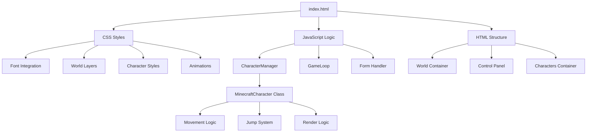
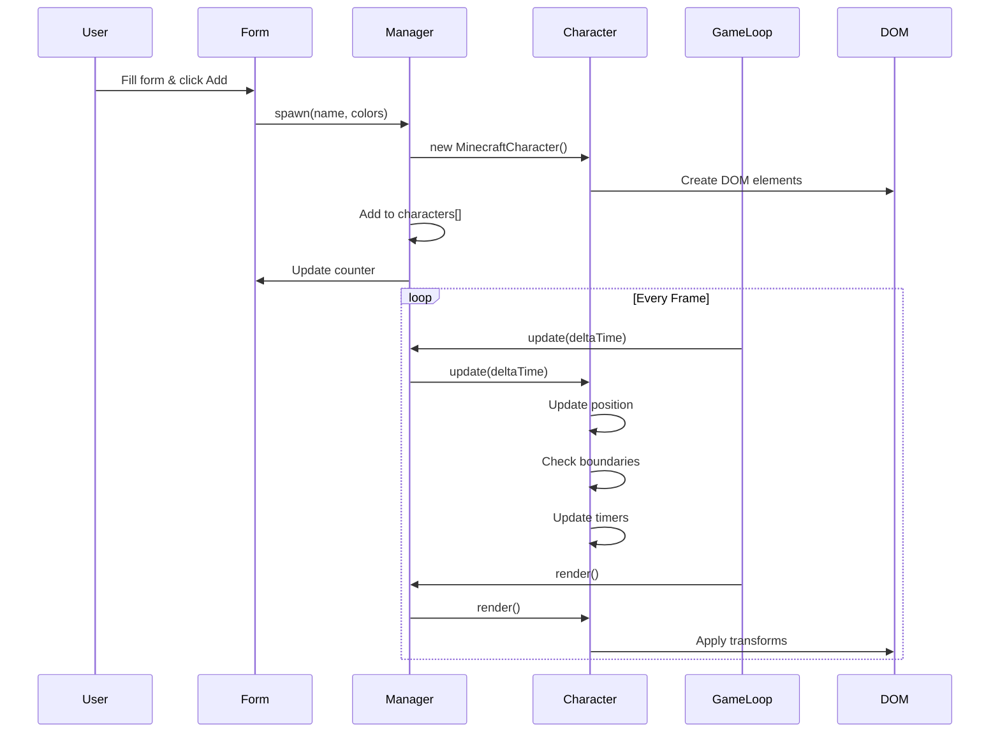
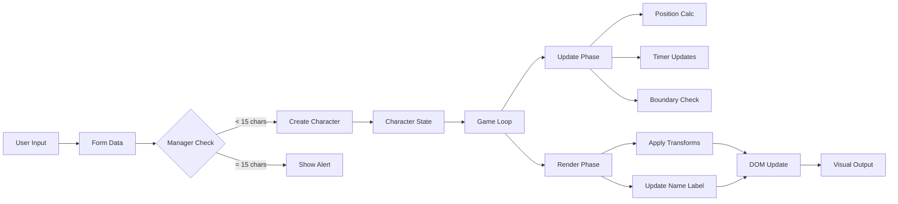

# Implementation Guide - Minecraft Character Simulator

## Quick Reference

### Project Files

- **Main File**: [`index.html`](index.html) - Single file containing all HTML, CSS, and JavaScript
- **Font Files**: [`fonts/minecrafter/`](fonts/minecrafter/) - Minecraft pixel fonts
- **Architecture**: [`ARCHITECTURE.md`](ARCHITECTURE.md) - High-level design and features
- **Technical Spec**: [`TECHNICAL_SPEC.md`](TECHNICAL_SPEC.md) - Detailed implementation details

## System Architecture Diagram



## Component Interaction Flow



## Data Flow



## Key Code Snippets

### 1. Font Integration (CSS)

```css
@font-face {
  font-family: "Minecrafter";
  src: url("fonts/minecrafter/subset-Minecrafter.woff2") format("woff2"), url("fonts/minecrafter/subset-Minecrafter.woff")
      format("woff"),
    url("fonts/minecrafter/subset-Minecrafter.ttf") format("truetype");
  font-weight: normal;
  font-style: normal;
  font-display: swap;
}

* {
  font-family: "Minecrafter", "Courier New", monospace;
}
```

### 2. Character Spawning

```javascript
spawn(name, colors) {
    if (!this.canSpawn()) {
        alert('Maximum 15 characters reached!');
        return null;
    }

    const character = new MinecraftCharacter(name, colors, this.nextId++);
    character.spawn(this.container);
    this.characters.push(character);
    this.updateCounter();

    return character;
}
```

### 3. Movement Update

```javascript
update(deltaTime) {
    // Update timers
    this.directionTimer -= deltaTime * 1000;
    this.jumpTimer -= deltaTime * 1000;

    // Random direction change
    if (this.directionTimer <= 0) {
        this.velocity.x = (Math.random() - 0.5) * 100;
        this.direction = this.velocity.x > 0 ? 'right' : 'left';
        this.directionTimer = this.randomInterval(2000, 4000);
    }

    // Random jump
    if (this.jumpTimer <= 0 && !this.isJumping) {
        this.isJumping = true;
        this.jumpProgress = 0;
        this.jumpTimer = this.randomInterval(3000, 7000);
    }

    // Update position
    this.position.x += this.velocity.x * deltaTime;

    // Boundary check
    const worldWidth = window.innerWidth;
    const charWidth = window.innerHeight * 0.1 / 3;

    if (this.position.x < 0) {
        this.position.x = 0;
        this.velocity.x = Math.abs(this.velocity.x);
    } else if (this.position.x > worldWidth - charWidth) {
        this.position.x = worldWidth - charWidth;
        this.velocity.x = -Math.abs(this.velocity.x);
    }

    // Update jump
    if (this.isJumping) {
        this.jumpProgress += deltaTime * 1.67;
        if (this.jumpProgress >= 1) {
            this.isJumping = false;
            this.jumpProgress = 0;
        }
    }
}
```

### 4. Render Logic

```javascript
render() {
    if (!this.element) return;

    // Calculate jump offset
    const jumpOffset = this.getJumpOffset();

    // Apply position transform
    this.element.style.transform = `translate3d(${this.position.x}px, ${-jumpOffset}px, 0)`;

    // Update name label position (stays above character)
    const nameLabel = this.element.querySelector('.name-label');
    if (nameLabel) {
        nameLabel.style.transform = `translateY(${jumpOffset}px)`;
    }

    // Toggle walking class
    if (Math.abs(this.velocity.x) > 1) {
        this.element.classList.add('walking');
    } else {
        this.element.classList.remove('walking');
    }

    // Flip character based on direction
    if (this.direction === 'left') {
        this.element.style.transform += ' scaleX(-1)';
    }
}
```

### 5. Jump Calculation

```javascript
getJumpOffset() {
    if (!this.isJumping) return 0;

    // Parabolic arc equation: -4(x - 0.5)² + 1
    const progress = this.jumpProgress;
    const height = -4 * Math.pow(progress - 0.5, 2) + 1;
    const maxHeight = window.innerHeight * 0.08;

    return height * maxHeight;
}
```

## CSS Organization

### Layer Structure

```
1. Reset & Base Styles
2. Font Definitions
3. CSS Variables
4. World Container
5. Background Layers (Sky, Grass, Dirt)
6. Character Base Styles
7. Character Parts (Head, Body, Arms, Legs)
8. Name Labels
9. Control Panel
10. Animations (Walking, Jumping)
11. Responsive Adjustments
```

## JavaScript Organization

### Module Structure

```
1. Character Class
   - Constructor
   - Spawn method
   - Update method
   - Render method
   - Helper methods

2. Character Manager
   - Characters array
   - Spawn management
   - Update all characters
   - Render all characters
   - Counter update

3. Game Loop
   - Delta time calculation
   - Update phase
   - Render phase
   - Frame request

4. Form Handler
   - Input validation
   - Character creation
   - Counter update
   - Button state

5. Initialization
   - Create manager
   - Create game loop
   - Attach form handler
   - Start game loop
```

## Testing Checklist

### Visual Tests

- [ ] World background renders correctly with sky, grass, and dirt layers
- [ ] Characters have proper Minecraft proportions (square head, rectangular body)
- [ ] Colors apply correctly to skin, shirt, and pants
- [ ] Name labels appear above characters
- [ ] Minecraft font loads and displays properly

### Animation Tests

- [ ] Characters walk smoothly across screen
- [ ] Arms and legs animate when walking
- [ ] Characters jump at random intervals
- [ ] Jump animation follows parabolic arc
- [ ] Name labels stay positioned above characters during jumps

### Behavior Tests

- [ ] Characters stay within viewport boundaries
- [ ] Characters reverse direction at edges
- [ ] Characters change direction randomly every 2-4 seconds
- [ ] Characters jump every 3-7 seconds
- [ ] Multiple characters move independently

### Interaction Tests

- [ ] Form accepts character name input
- [ ] Color pickers work for skin, shirt, and pants
- [ ] Add button spawns new character with correct properties
- [ ] Counter shows correct character count (X/15)
- [ ] Form prevents spawning beyond 15 characters
- [ ] Button disables when max reached

### Performance Tests

- [ ] 60fps with 1 character
- [ ] 60fps with 5 characters
- [ ] 60fps with 10 characters
- [ ] 60fps with 15 characters
- [ ] No memory leaks after spawning/despawning
- [ ] Smooth animations on different viewport sizes

## Common Issues & Solutions

### Issue: Font not loading

**Solution**: Verify font paths are relative to HTML file location

```css
src: url("fonts/minecrafter/subset-Minecrafter.woff2") format("woff2");
```

### Issue: Characters moving too fast/slow

**Solution**: Adjust velocity multiplier in Character class

```javascript
this.velocity.x = (Math.random() - 0.5) * 100; // Adjust 100
```

### Issue: Jump height too low/high

**Solution**: Modify max jump height calculation

```javascript
const maxHeight = window.innerHeight * 0.08; // Adjust 0.08
```

### Issue: Characters overlapping boundaries

**Solution**: Check character width calculation and boundary logic

```javascript
const charWidth = (window.innerHeight * 0.1) / 3; // Character width
if (this.position.x > worldWidth - charWidth) {
  /* reverse */
}
```

### Issue: Name label not following character

**Solution**: Update name label in render method

```javascript
nameLabel.style.transform = `translateY(${jumpOffset}px)`;
```

## Browser Compatibility

### Minimum Requirements

- Chrome 90+
- Firefox 88+
- Safari 14+
- Edge 90+

### Required Features

- CSS Grid/Flexbox
- CSS Custom Properties (variables)
- CSS Transforms
- RequestAnimationFrame
- ES6 Classes
- Template Literals
- Arrow Functions

## Performance Metrics

### Target Performance

- **FPS**: 60fps constant
- **Memory**: < 50MB with 15 characters
- **CPU**: < 20% usage
- **Load Time**: < 1 second

### Optimization Techniques Applied

1. CSS transforms (GPU accelerated)
2. RequestAnimationFrame for smooth animation
3. Delta time for frame independence
4. Cached DOM references
5. Efficient boundary checking
6. Minimal reflows/repaints
7. Transform translate3d for GPU
8. will-change hints for animated elements

## Next Steps for Implementation

1. **Phase 1: Foundation** (HTML/CSS Structure)

   - Set up HTML document structure
   - Create world container with layers
   - Integrate Minecraft fonts
   - Style background layers

2. **Phase 2: Character System** (CSS/JS)

   - Build character component styles
   - Create animation keyframes
   - Implement Character class
   - Test character rendering

3. **Phase 3: Interaction** (JavaScript)

   - Build CharacterManager
   - Create form handler
   - Implement spawn logic
   - Add counter functionality

4. **Phase 4: Animation** (JavaScript)

   - Implement movement logic
   - Add jump system
   - Create game loop
   - Add boundary detection

5. **Phase 5: Polish** (Testing/Refinement)
   - Test all features
   - Optimize performance
   - Fix edge cases
   - Final adjustments

## File Size Estimate

- HTML: ~100 lines
- CSS: ~400 lines
- JavaScript: ~500 lines
- **Total**: ~1000 lines in single file
- **File Size**: ~30-40KB (uncompressed)

## Completion Criteria

✅ **Functional Requirements**

- Single HTML file with embedded CSS/JS
- Full viewport world with Minecraft landscape
- Blocky character with authentic proportions
- Customizable colors (skin, shirt, pants)
- Autonomous walking behavior
- Random jumping animations
- Floating name labels
- Interactive control panel
- 15-character limit
- Collision-free movement

✅ **Technical Requirements**

- No external libraries
- Minecraft fonts integrated
- 60fps performance
- Responsive to viewport changes
- Memory efficient
- Browser compatible

✅ **Quality Requirements**

- Clean, readable code
- Proper code organization
- Comments for complex logic
- Tested functionality
- Polished animations
- Professional appearance
