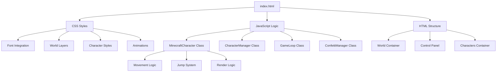

# 🎮 Minecraft Character Simulator

[](https://developer.mozilla.org/en-US/docs/Web/HTML)
[](https://developer.mozilla.org/en-US/docs/Web/CSS)
[](https://developer.mozilla.org/en-US/docs/Web/JavaScript)
[](https://developer.mozilla.org/en-US/docs/Web/JavaScript)
[](https://en.wikipedia.org/wiki/Vanilla_software)
[](https://developer.mozilla.org/en-US/docs/Learn/CSS/CSS_layout/Responsive_Design)

> A fully functional Minecraft-style character simulator built with pure HTML5, CSS, and vanilla JavaScript. Create and watch up to 15 autonomous blocky characters roam around in a beautiful birthday-themed Minecraft world!

## ✨ Features

### 🎨 Character Customization

- **Customizable Colors**: Choose skin tone, shirt color, and pants color for each character
- **Character Sizes**: Create adult or kid-sized characters
- **Unique Names**: Give each character a personalized name that floats above their head

### 🤖 Autonomous Behavior

- **Random Walking**: Characters move left and right with natural-looking motion
- **Random Jumping**: Characters jump at random intervals with smooth parabolic arcs
- **Boundary Detection**: Characters automatically turn around at screen edges
- **Independent Movement**: Each character moves independently without collision

### 🎪 Visual Effects

- **Authentic Minecraft Aesthetics**: Blocky character proportions and pixel-perfect styling
- **Minecraft Font**: Custom Minecrafter font throughout the interface
- **Animated Clouds**: Floating clouds that drift across the sky
- **Floating Sun**: Animated sun with pixelated texture
- **Birthday Theme**: Special birthday message and confetti celebration
- **Responsive Design**: Works beautifully on desktop and mobile devices

### 🎮 Interactive Controls

- **Easy Character Creation**: Simple form to spawn new characters
- **Real-time Counter**: Shows current character count (max 15)
- **Character Removal**: Double-click any character to remove them
- **Persistent Storage**: Characters are saved to localStorage and persist between sessions

### ⚡ Performance Optimized

- **60 FPS Animation**: Smooth animations using requestAnimationFrame
- **GPU Acceleration**: CSS transforms for hardware-accelerated rendering
- **Memory Efficient**: Optimized DOM manipulation and cleanup
- **No External Dependencies**: Pure vanilla JavaScript implementation

## 🚀 Demo


_Watch autonomous Minecraft characters roam around in a beautiful birthday-themed world!_

## 📋 Table of Contents

- [Features](#-features)
- [Demo](#-demo)
- [Installation](#-installation)
- [Usage](#-usage)
- [Architecture](#-architecture)
- [Technical Specifications](#-technical-specifications)
- [Development](#-development)
- [Testing](#-testing)
- [Contributing](#-contributing)
- [License](#-license)
- [Credits](#-credits)

## 📦 Installation

### Option 1: Direct Download

1. Download the project files
2. Open `index.html` in any modern web browser
3. No server required - works directly from file system!

### Option 2: Clone Repository

```bash
git clone https://github.com/yourusername/birthday-minecraft-animation-html5.git
cd birthday-minecraft-animation-html5
# Open index.html in your browser
```

### Option 3: Live Server (Recommended for development)

```bash
# Using Node.js live-server
npm install -g live-server
live-server

# Or using Python
python -m http.server 8000

# Or using PHP
php -S localhost:8000
```

## 🎯 Usage

### Creating Characters

1. **Open the application** in your web browser
2. **Fill out the character form** in the top-right control panel:
   - Enter a character name (required)
   - Select character size (Adult/Kid)
   - Choose skin, shirt, and pants colors
3. **Click "Agregar Personaje"** to spawn your character
4. **Watch them come to life!** Characters will start walking and jumping autonomously

### Managing Characters

- **Maximum 15 characters** can be active at once
- **Double-click any character** to remove them
- **Characters persist** between browser sessions via localStorage
- **Counter shows** current character count (X/15)

### Controls

- **Spawn Form**: Located in top-right corner
- **Character Counter**: Shows current/max characters
- **Responsive**: Works on desktop, tablet, and mobile

## 🏗️ Architecture

### Project Structure

```
birthday-minecraft-animation-html5/
├── index.html          # Main HTML file (single-file app)
├── css/
│   └── styles.css      # All styling and animations
├── js/
│   └── main.js         # Game logic and character management
├── fonts/
│   └── minecrafter/    # Minecraft pixel fonts
├── img/                # Background images and assets
├── ARCHITECTURE.md     # High-level design documentation
├── IMPLEMENTATION_GUIDE.md  # Detailed implementation guide
├── TECHNICAL_SPEC.md   # Technical specifications
└── README.md          # This file
```

### Component Architecture



### Key Classes

#### MinecraftCharacter

- Manages individual character state and behavior
- Handles movement, jumping, and rendering
- Maintains character-specific properties (name, colors, size)

#### CharacterManager

- Oversees all active characters
- Handles spawning, removal, and persistence
- Manages character limits and counter updates

#### GameLoop

- Runs at 60 FPS using requestAnimationFrame
- Updates all characters and handles rendering
- Manages delta time for smooth animations

## 🔧 Technical Specifications

### Browser Requirements

- **Chrome**: 90+
- **Firefox**: 88+
- **Safari**: 14+
- **Edge**: 90+

### Supported Features

- CSS Grid & Flexbox
- CSS Custom Properties (Variables)
- CSS Transforms & Animations
- RequestAnimationFrame
- ES6 Classes & Arrow Functions
- LocalStorage API

### Performance Metrics

- **Target FPS**: 60 FPS constant
- **Memory Usage**: < 50MB with 15 characters
- **CPU Usage**: < 20% on modern hardware
- **Load Time**: < 1 second

### Character Specifications

- **Height**: 10% of viewport height
- **Proportions**: Authentic Minecraft blocky design
- **Movement Speed**: 50-100 pixels/second
- **Jump Height**: 8% of viewport height
- **Animation**: 60 FPS with smooth interpolation

## 💻 Development

### Prerequisites

- Modern web browser with ES6 support
- Text editor (VS Code recommended)
- Local web server (optional but recommended)

### Development Setup

1. **Clone the repository**
2. **Open in your editor**
3. **Start a local server** (see Installation section)
4. **Make changes** to HTML, CSS, or JavaScript files
5. **Refresh browser** to see changes instantly

### Code Organization

- **Single-file architecture** - everything in `index.html`
- **Modular JavaScript** with ES6 classes
- **CSS custom properties** for theming
- **Performance-optimized** animations and rendering

### Building & Deployment

No build process required! The application is ready to deploy as-is.

```bash
# Just upload these files to any web server:
# - index.html
# - css/styles.css
# - js/main.js
# - fonts/ (directory)
# - img/ (directory)
```

## 🧪 Testing

### Manual Testing Checklist

- [ ] World background renders correctly
- [ ] Characters spawn with correct appearance
- [ ] Walking animations work smoothly
- [ ] Jumping animations follow parabolic arcs
- [ ] Boundary detection prevents characters from leaving screen
- [ ] Name labels stay positioned above characters
- [ ] Maximum 15 characters enforced
- [ ] Characters persist between sessions
- [ ] Responsive design works on mobile
- [ ] Performance remains smooth with 15 characters

### Browser Compatibility Testing

Tested on:

- [ ] Chrome 90+
- [ ] Firefox 88+
- [ ] Safari 14+
- [ ] Edge 90+
- [ ] Mobile browsers (iOS Safari, Chrome Mobile)

### Performance Testing

- [ ] 60 FPS maintained with 1 character
- [ ] 60 FPS maintained with 5 characters
- [ ] 60 FPS maintained with 10 characters
- [ ] 60 FPS maintained with 15 characters
- [ ] Memory usage stays under 50MB
- [ ] No memory leaks during extended use

## 🤝 Contributing

We welcome contributions! Here's how you can help:

### Ways to Contribute

- **🐛 Bug Reports**: Found a bug? [Open an issue](https://github.com/yourusername/birthday-minecraft-animation-html5/issues)
- **💡 Feature Requests**: Have an idea? [Suggest it](https://github.com/yourusername/birthday-minecraft-animation-html5/issues)
- **🔧 Code Contributions**: Want to fix or improve something?
- **📖 Documentation**: Help improve documentation

### Development Workflow

1. **Fork the repository**
2. **Create a feature branch**: `git checkout -b feature/your-feature-name`
3. **Make your changes**
4. **Test thoroughly** across different browsers
5. **Commit with clear messages**: `git commit -m "Add: feature description"`
6. **Push to your fork**: `git push origin feature/your-feature-name`
7. **Create a Pull Request**

### Code Standards

- Use ES6+ JavaScript features
- Follow consistent naming conventions
- Add comments for complex logic
- Test across multiple browsers
- Maintain performance standards

## 🙏 Credits

### Development

- **Concept & Design**: Minecraft Character Simulator Team
- **Lead Developer**: Christopher Quiros
- **Architecture**: Based on vanilla JavaScript best practices

### Assets & Resources

- **Minecraft Font**: Minecrafter font family
- **Background Images**: Custom Minecraft-themed textures
- **Icons & Badges**: Shields.io for status badges

### Inspiration

- **Minecraft**: The original game that inspired this project
- **Web Animation**: Modern CSS and JavaScript animation techniques
- **Game Development**: Classic autonomous character behaviors

### Special Thanks

- Mojang Studios for creating Minecraft
- The web development community for sharing knowledge
- Everyone who tests and provides feedback

---

<div align="center">

**Made with ❤️ and vanilla JavaScript**

[🌟 Star this repo](https://github.com/fufales/birthday-minecraft-animation-html5/stargazers) • [🐛 Report bugs](https://github.com/fufales/birthday-minecraft-animation-html5/issues) • [💡 Request features](https://github.com/fufales/birthday-minecraft-animation-html5/issues)

</div>
